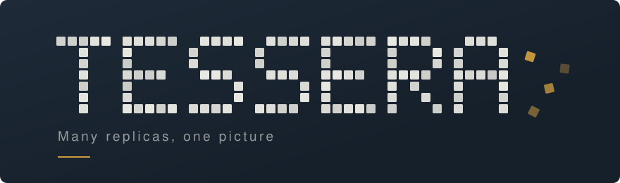
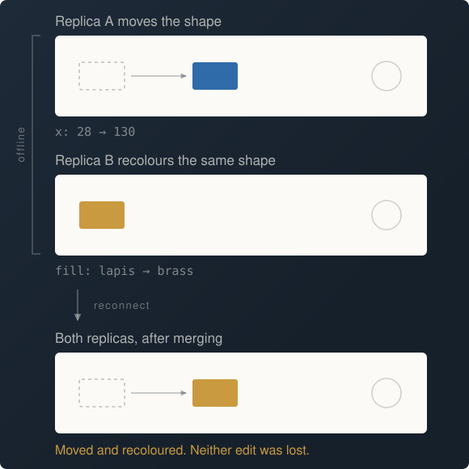

Tessera is a real-time collaborative canvas. Several people draw on one board at once, from
different machines, over unreliable networks — and every replica ends up showing the same picture.

The merge engine is written from scratch rather than imported. That is the point of the project.


## The problem

A whiteboard is a shared mutable document edited concurrently with no lock. Three requirements pull
against each other:

**Convergence.** Two replicas that have seen the same edits must show the same document, whatever
order those edits arrived in.

**Local responsiveness.** A drag has to render on the next frame. A frame is 16.7ms; a round trip
to `us-east-1` is 30–80ms. The interface cannot wait for the server.

**Offline tolerance.** A client that loses the network keeps working, and rejoins without losing or
duplicating anything.

The second forces every edit to apply locally before the server has seen it. Combined with the
first, that forces a merge strategy — because two people will always change the same thing before
either learns about the other. The third rules out the server being the only source of truth.

<p align="center">
  
</p>

<p align="center"><sub>One user drags a shape while another recolours it. Both edits have to survive.</sub></p>

That case is the one naive designs get wrong. Storing a shape as a single value with a single
timestamp makes the later write discard the earlier one wholesale, which users experience as "my
changes disappeared". In Tessera every scalar property is its own mergeable register, so edits to
different properties never contend.

## How it works

**Hybrid logical clocks.** Machine clocks disagree by seconds to minutes, so ordering edits by wall
time lets one fast clock win every conflict forever — and a slow one never win at all. Both failures
are silent. Tessera timestamps every operation with a physical component, which keeps "most recent"
meaning roughly what a human expects, and a logical counter that carries ordering when physical time
cannot. Peers implausibly far ahead are rejected, so one wrong clock cannot poison the rest.

**Fractional indexing.** Integer z-indices renumber every shape above an insertion point, so a
single reorder touches hundreds of shapes and two concurrent reorders produce overlapping rewrites
no merge rule can reconcile. Shapes instead carry variable-length base-62 keys with room between any
two, so reordering rewrites exactly one key. An integer part keeps appends at constant length, which
matters because appending is what every newly drawn shape does.

**One actor per board.** Concurrent mutation of a shared document is where convergence bugs hide,
and they are unreproducible by nature. Every message for a board funnels through a single channel
consumer that owns the replica — no locks, deterministic order per document, and concurrency that
lives between boards rather than inside one.

**Add-wins deletion.** An edit concurrent with a delete keeps the shape. The costs are asymmetric: a
shape that wrongly survives is deleted again with one keystroke, while one wrongly removed is work
the user may never get back.

[**ARCHITECTURE.md**](ARCHITECTURE.md) covers the wire protocol, persistence, and the alternatives
that were rejected — including why not OT, and why not simply using Yjs.

## Status

Server-side is done and runnable. The browser client is not built yet.

| Component | State |
| :-- | :-- |
| CRDT core | Done · 43 tests |
| Rooms, protocol, repository | Done · 37 tests |
| WebSocket server | Done |
| TypeScript client | Not started |
| Postgres repository | Not started |
| AWS infrastructure | Not started |

## Running it

Requires the [.NET 10 SDK](https://dotnet.microsoft.com/download).

```bash
cd server && dotnet run --project src/Tessera.Server
```

| Endpoint | Purpose |
| :-- | :-- |
| `GET /health` | Liveness |
| `GET /api/boards/{id}` | Merged document |
| `GET /api/boards/{id}/socket` | Sync connection |

With the server up, the smoke script drives it end to end — two clients on one board, operations
broadcast to peers but never echoed to their author, presence that never touches the log, and a push
forged as another replica refused:

```bash
node scripts/smoke.mjs
```

## Tests

```bash
cd server && dotnet test
```

Convergence is checked as a property rather than by example. A generated 400-operation session
across three replicas is replayed in 200 random delivery orders, and every ordering must produce a
byte-identical document. Idempotence and associativity are checked the same way — the orderings that
break a merge are precisely the ones nobody thinks to write by hand.

The build runs with `TreatWarningsAsErrors` and the recommended analyzer set.

## Project layout

```
server/src/Tessera.Crdt      merge engine — no transport, no storage, no framework
server/src/Tessera.Sync      rooms, wire protocol, repository abstraction
server/src/Tessera.Server    WebSocket host
server/tests                 xUnit suites
scripts/smoke.mjs            end-to-end check against a running server
```

The merge engine has no dependency on ASP.NET, a database, or a transport — it is a pure function of
the operations it is given, which is what lets it be tested without a network and reused on both
sides of one.

## License

MIT
